#  Build massive and lightning-fast analytics solutions with Azure Data Explorer  
 
Looking to help your customers make business decisions with immediate impact based on real-time terabyte/petabyte of data in seconds? In this session, you will build a near-real-time analytical solution with Azure Data Explorer (ADX), which supports interactive adhoc queries of terabyte/petabyte data.  
 
Walk away with a solution for your frustrated customers, so they can make immediate and impactful business decisions from their data using ADX.  
 
**Contents**
 
 <!-- TOC -->

- Infrastructure 
- Ingestion
- Exploration
 - Questions 
 - KQL
 - Results
- Self-Study   
  - Kusto Query Language (KQL)
  - Questions to try out 
  - Power BI   
     - PBI demo script 
     - Connect to Help cluster  
     - Create Power BI report 
      
   - KQL-Results
   
  <!-- TOC -->   
## Infrastructure  
    
1. Open Lab: http://bit.ly/2WCFDdz  
     - **Register Now**: Complete registration information on page  
     - **Select LAUNCH LAB**: Opens the **Environment Details** page  
     - Open the Lab guide: "**LAB GUIDE URL**"
      
2. Open Azure portal in private mode: https://portal.azure.com  

      - Connect with the Azure **Credentials**:  
   


   - The portal opens with your credentials:  
      
      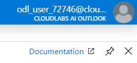
    
 3. Search and select Azure Data Explorer Clusters.
   
       
   
 4. In the **Azure Data Explorer Clusters** window, select the **KustoSUFFIX** cluster.
     
       
    
 5. Select **Data** from the left-hand menu, under **Databases** , and then select **+Add Database** . 
   
       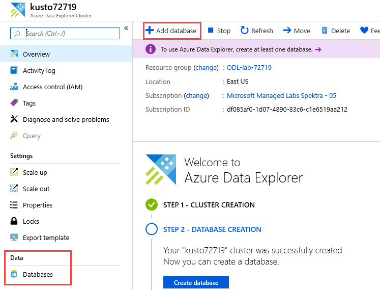  
    
 6. In the **Azure Data Explorer Database** window:  
    
       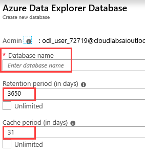
    
      - **Database name**: **<alias>_adxdb** 
      - **Retention period** (cold compressed data (Azure Blob Storage) : **365**
      - **Cache period**(hot compressed data (SSD)): **31**
 
 7. In **Databases**, select your new **alias_adxdb database**
 
 8. Select **Query**
 
   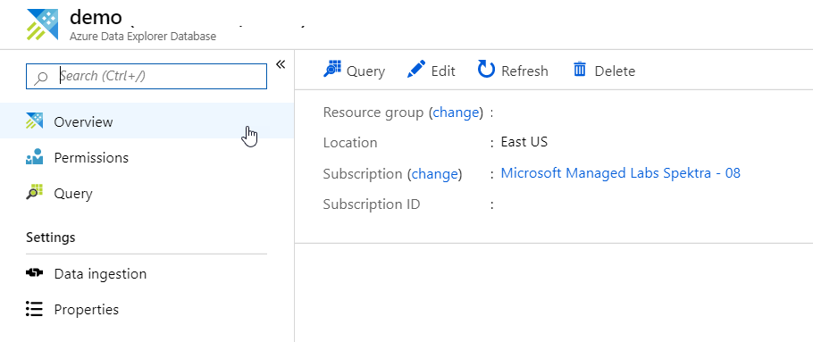
   
 9. In the Web UI, create a table 
  ```
  // Create a table
  .create table SampleTable
  (Timestamp:datetime, ApiVersion:string, User:string, RawHeader:dynamic)
```  

## Ingestion

  
   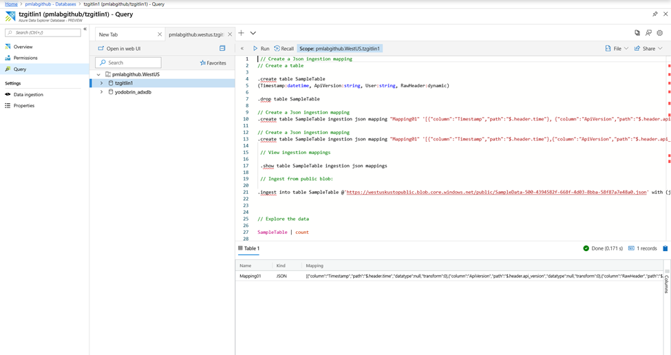
  
1. Create table mapping  
```
// Create a Json ingestion mapping
.create table SampleTable ingestion json mapping 
"Mapping01" '[{"column":"Timestamp","path":"$.header.time"},{"column":"ApiVersion","path":"$.header.api_version"},{"column":"RawHeader","path":"$.header"},{"column":"User","path":"$.payload.user"}]'
```

2. View ingestion mapping 
 ```
 // View ingestion mappings
.show table SampleTable ingestion json mappings  
 ```
 
3. Ingestion from public blob 
 ``` 
 // Ingest from public blob
 .ingest into table SampleTable
 @'https://westuskustopublic.blob.core.windows.net/public/SampleData-500-4394582f-668f-4d03-8bba-58f87a7e48a0.json'
 with (jsonMappingReference = "Mapping01")  
   ```  
  > **Note**: Must follow the query syntax.

## Exploration 
### Questions 
 
If you skipped the previous step(s), please click on database: **text**. 

1. How many lines were ingested? 
2. Add calculated column of Transaction Id from column RawHeader: attribute Id
3. Take a 10 row sample of RawHeader 
4. How many records were ingested from version 1 and 2?
5. Create a time chart with 10 minute bins of RawHeader['time']
6. Drop table SampleTable
7. Run.show queries  

### Kusto Query Language (KQL) 
- … | **count**	
  Counts records in input table (e.g. T)  
  
 - … | **take** 10	
 	Get few records to become familiar with the data. No order ensured.  

- … | **where** Timestamp > ago(1) and UserId = ‘abdcdef’	
 	Filters on specific fields  
  
- … | **project** Col1, Col2, …	
 	Select some columns (use if input table has many columns)  
  
- … | **extend** NewCol1=Col1+Col2		
	Introduces new calculated columns  
 
- … | **render** timechart		
	Plots the data (in KE and KWE) while exploring  
 
- … | **summarize** count(), dcount(Id) by Col1, Col2		
	Analytics: aggregations  
 
- … | **top** 10 by count_ desc 
	Finds the needle in the haystack  
 
- … | **join** (…) on Key1, Key2 
	Joins data sets 
 
- … | **mvexpand** Col1,Col2 … 
	Turns dynamic arrays to rows (multi-value expansion)  
 
- … | **parse** Col1 with <pattern>…
	Deals with unstructured data  
 
### Results  
1. SampleTable | count 

2. SampleTable | extend TransactionId = RawHeader.id

3. SampleTable
| extend TransactionId = RawHeader.id  
| take 10 

4. Option 1  
    a. SampleTable  
    | extend recordversion =  tostring(RawHeader.api_version)  
   | summarize count() by recordversion  
    b. SampleTable  
    | where tostring(RawHeader.api_version) has "1" 
    
5. SampleTable  
| extend x = todatetime(RawHeader['time'])  
| summarize count() by bin(x, 10m)  
| render timechart  

6. Drop table  
// Drop the table  
.drop table SampleTable  

7. Show queries  
.show queries  

## Self-Study  
  
### Kusto Query Language (KQL)  

We’ll use GitHub public data to query using Azure Data Explorer (Kusto) and visualize using Power BI.  

1. Open the Browser and connect with the temporary Lab user credentials.  


 
2. Open <https://dataexplorer.azure.com/clusters/demo12.westus/databases/GitHub>  
  - Cluster URL: <http://demo12.westus.kusto.windows.net>  
  - Database: GitHub  
  
### Questions to try out
  
1. What was the date yesterday?  
2. How many events were in the last 60 days?  
3. Take a sample of 10 rows of your data?  
4. What is the number of Repos overall?  
5. What is the number of unique Repos values?  
6. What is the number  of unique Repos names?  
7. Linus Torvalds, actor on GitHub is ‘torvalds’ (Actor.display_name). What are the top 3 event Types to which he contributed?    
8. How many Torvalds are there? How many events did they produce?  
9. What are the top 10 most watched Repos?  
10. (**) Plot the history of all of the events for the past 2 years for Repos from #9. 

## Power BI  
Power BI is used to visualize the data. Note that Power BI is a visualization tool with data size limitations. Default: 500,000 records and 700MB data size. 

### PBI demo script  
1. Open Lab Environment Details page: <http://bit.ly/2WCFDdz> 
2. Select **GO TO LAB ENVIRONMENT->**  

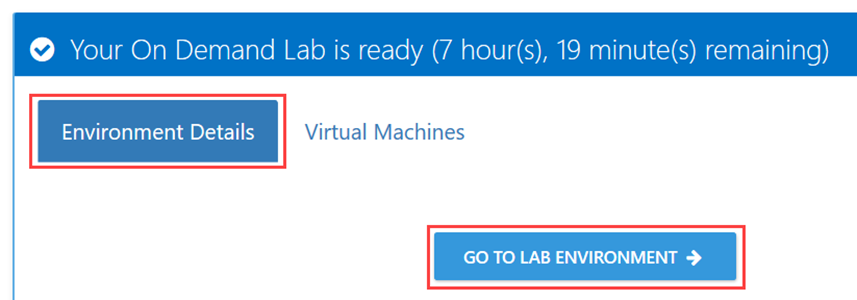

### Connect to Help cluster  
1. Connect with the Lab **Azure Credentials** :  

  

2. Open Power BI desktop, select **Get Data**, and **More…** Type **Data Explorer** in the search box.

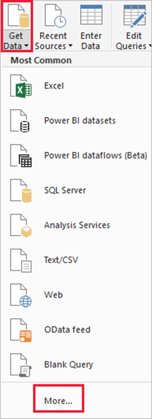  

3. Select **Azure Data Explorer (Kusto)** and **Connect** 

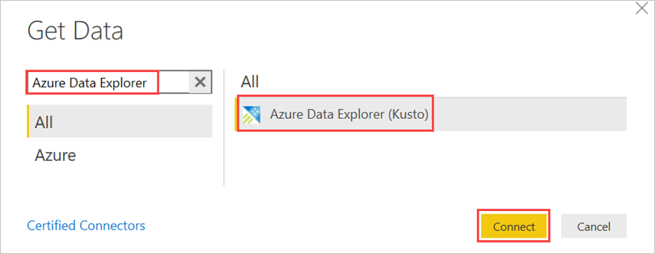  

4. Enter the following properties (leave all other fields empty) and then select **OK**  
 Cluster: **Help**  
 Database: **Samples**  
 Table name or Azure Data Explorer query: **StormEvents**  
 Data Connectivity mode: **Import**  
 
  
 
 5. Expand the Samples database and select StormEvents. If the table looks ok, select Load. To make changes, select Edit. 
 
 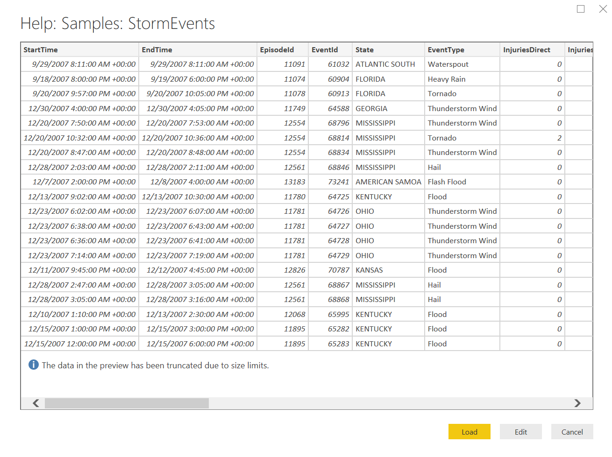  
 
 6. The new StormEvents table was added to the Power BI report.  
 
   
 
 ### Create a Power BI report  
 
 1. Create a line chart with the total number of events, by putting “Start Time” in the Axis box (not in Date Hierarchy mode) and     EventId in the Values box.  
 
   
 
 2. Add a Map tile by putting “BeginLat” in the Latitude box and putting “BeginLon” in the Longitude box.  
 
 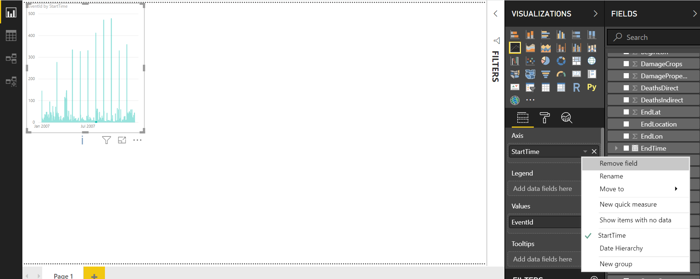  
 
 3. Create a Clustered column chart by putting “Event Type” in the Axis box and (count) “Event Id” in the value box.  
 
 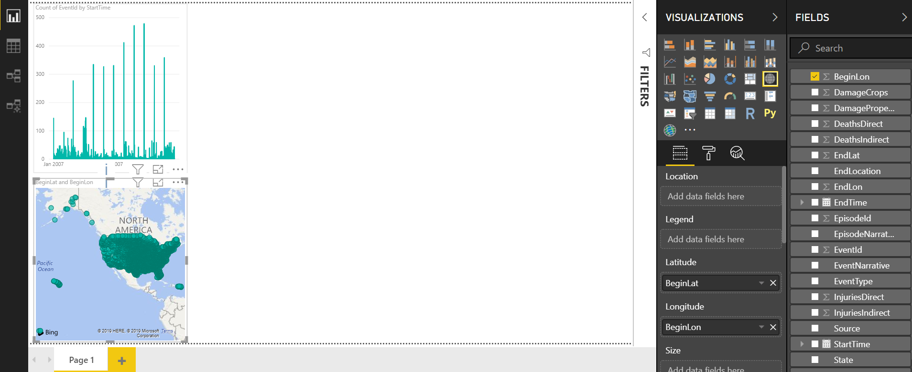  
 
 4. Create 4 separate card tiles with “DeathDirect”, “DeathIndirect”, “InjuriesDirect” and “InjuriesIndirect in the Fields box.  
 
 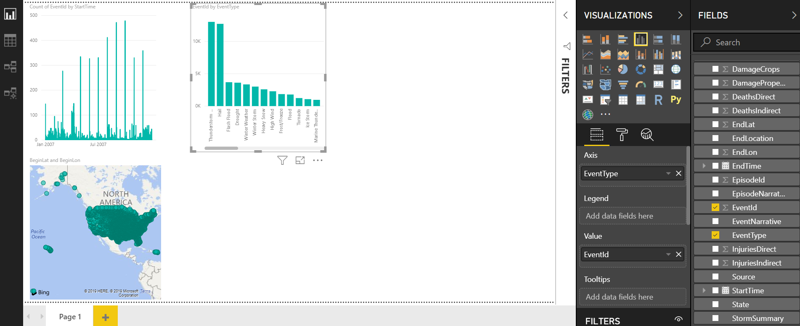  
 
 5. Create a pie chart of reporting sources by putting the “Source” in the legend box and putting the (count) “EventId” in the values   box.  
 
 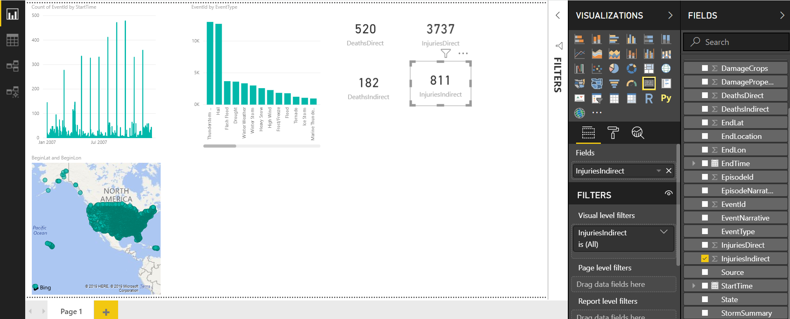  
 
 6. Now arrange the tiles on the canvas and you’re ready to slice and dice.  
 
 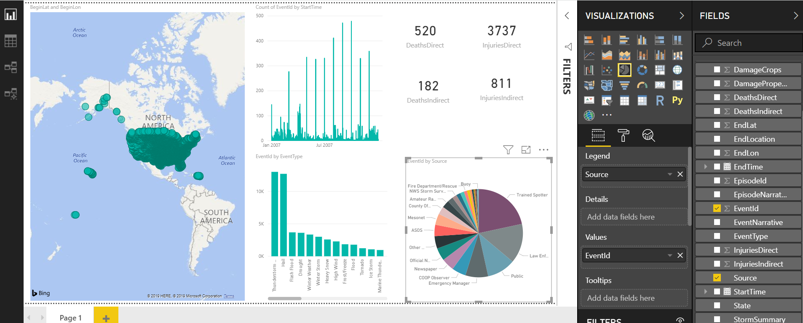  
 
 ### 3 Power BI Connectors  
 1. Native Connector for Power BI
    - Native Connector **->** data explorer **->** Connect **->** Preview Feature (accept) continue.
    - Cluster: demo12.westus
    - Database: GitHub
    - Table: GithubEvent
    - Import **->** load data in advanced 
	- Seamless browsing experience   
	- Data size limitation  
    - **(Click) Direct Query load data per request** 
	- Load per request 
	- Longer response time 
   - Sign-in **->** connect 
   - Data sample **->** load 
   - Drag ID from the Fields on the right side of the screen 
   - Drag CreatedAt
   - Drag CreatedAt into ID square 
2. Blank Query for Power BI
   - Get Data **->** Blank Query 
   - Kusto Explorer **->** Tools **->** Query to Power BI (Query & PBI adaptor)
   - Connect - Organization account **->** use your account 
   - Click on **->** Advanced editor **->** Delete everything **->** Paste everything 
3. MS-TDS (SQL) client for Power BI
   - (ODBS Connector) End Point: Azure  Azure SQL database 
     - Kusto Cluster as destination <https://docs.microsoft.com/en-us/azure/data-explorer/power-bi-sql-query>  

### KQL–Results   

1. How many events are there in Repos that have ‘Azure’ in their name?  
```  
// 1. What is count of events in Repos that have ‘Azure’ word in their name?
GithubEvent
| where Repo has 'Azure'
| count  
``` 

2. What is the total number of Repos?  
```  
// 2. What is the amount of the Repos overall?
GithubEvent
| summarize dcount(tostring(Repo))  
```  
3. Linus Torvalds Actor on GitHub is ‘torvalds’ (Actor.display_login). What are the top 3 event Types he contributes to?  
```  
// 3. Linus Torvalds Actor on GitHub is ‘torvalds’ (Actor.display_name). What are top 3 events Types he contributes to?  
GithubEvent
| where Actor.display_login == 'torvalds'
| summarize count() by Type
| top 3 by count_  
```  
4. How many Torvalds are there and how many events they produce?  
```  
// 4. How many Torvalds are there and how much events they produce?
//
GithubEvent
| where Actor has 'torvalds'
| summarize count() by name=tostring(Actor.display_login)
| where isnotempty(name)  
```  
5. What are the top 10 most watched Repos?  
```  
// 5. What are the top 10 most watched Repos?
GithubEvent
| where Type == 'WatchEvent'
| summarize count() by tostring(Repo.name)
| top 10 by count_   
```   
6. Plot the history of all events for Repos which are the answer for #5.  
```  
// 6. Plot the history of all events for the past 2 years for Repos coming out #5.
let repos = GithubEvent
| where Type == 'WatchEvent'
| summarize count() by name=tostring(Repo.name)
| top 10 by count_
| project name;
GithubEvent  
| where Repo.name in (repos)
| extend repo = tostring(Repo.name)
| summarize count() by bin(CreatedAt, 1d), repo
| render timechart  
```  
7. Show the top 10 repos by WatchEvent, along with their WatchEvent count and their total events count (hint: use join)  
```  
// 7. Show top 10 repos with most Watch Event and their total count of events (hint: use join)
GithubEvent
| where Type == 'WatchEvent'
| summarize WatchCounts = count() by name=tostring(Repo.name)
| top 10 by WatchCounts 
| join hint.strategy = broadcast  
(
    GithubEvent 
    | extend repo = tostring(Repo.name)
    | summarize TotalEvents=count() by repo
) on $left.name == $right.repo
| project repo, TotalEvents, WatchCounts 
| order by TotalEvents  
```  
